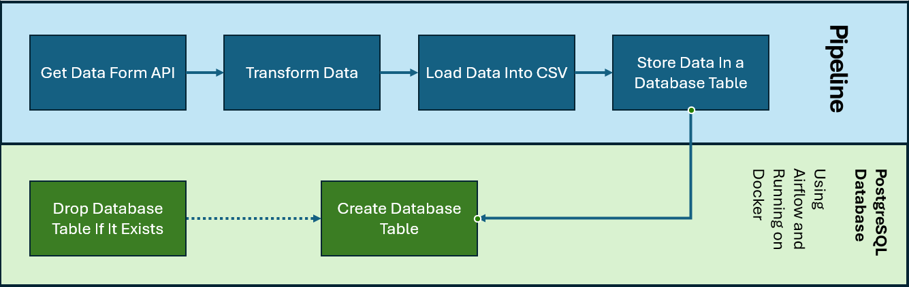

\# Project 1 - ETL with Airflow

This project consists of an ETL pipeline built with Apache Airflow containerised in Docker and utilising PostgreSQL.

\## Project Overview

This project demonstrates an ETL pipeline using Apache Airflow containerised in Docker.  

The project consists of the following:

* Extracts <data> data from <source>
* Transforms data into a load-able format (data cleaning if applicable)
* Loads transformed data into a PostgreSQL Database through Airflow
* Uses DAGs inside Airflow to schedule and perform tasks

\## Tools Used:

Workflow: Apache Airflow

Containerisation: Docker

Data Source: REST Countries API (https://restcountries.com)

Data Store: PostgreSQL

Documentation: READMEs across multiple folders

Project Management: Trello

\## Pipeline Design:

\## Setting up the environment:

\### 1. Clone the Repository from GitHub

git clone <>

cd "Project 1 - Airflow"

\### 2. Run in your preferred environment

Open with PyCharm (or any other IDE)  

Set up a virtual environment with PyCharm or your preferred Python interpreter to read and run the .py files  

\### 3. Start Docker with the .yaml file

Type "docker compose up" on any terminal when Docker Desktop is running. When done with the "-d" flag it will run in disjointed format  

Type "docker compose down" for when you want to stop and delete the containers whilst retaining the images  

\### 4. Access Airflow UI

Open your preferred browser and enter "http://localhost:8080" when Docker is running or click 8080:8080 on the "containers" section of Docker Desktop  

